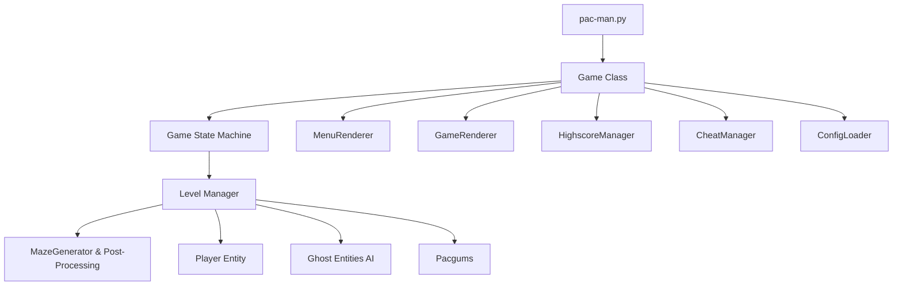

*This project has been created as part of the 42 curriculum by khhammou, mkhanji.*

## Description
This project is a modern Python recreation of the classic arcade game **Pac-Man**. Developed as part of the 42 curriculum, the game features autonomous ghost AI, a robust state machine architecture, dynamic maze generation, super-pacgums, and persistent highscore tracking. 

## Instructions
**Installation**
To install the required dependencies (such as `pygame`), run the following command in the project root:
```bash
make install
```

**Running the Game**
To launch the game, pass the configuration JSON file as an argument:
```bash
make run
# or manually:
python3 pac-man.py config.json
```

**Debugging**
To run the game with Python's built-in debugger:
```bash
make debug
```

**Controls**
- **Movement:** Up/Down/Left/Right Arrows or W/A/S/D
- **Pause:** P or ESC
- **Menu Navigation:** Arrow keys + ENTER
- **Cheat Mode:** I (Invincibility), N (Skip Level), F (Freeze Ghosts), L (Extra Life), B (Speed Boost)

## Resources
- **References:** Official Pac-Man arcade specifications, Toru Iwatani's game design principles, Pygame official documentation.

## Configuration
The game runs on a heavily customizable `config.json`. The configuration loader automatically handles missing keys or invalid values, clamping them to safe defaults to prevent any traceback or crashes.

**Example `config.json` elements:**
- `lives`: Number of starting lives (Default: 3).
- `points_per_pacgum`: Points rewarded per pellet (Default: 10).
- `level_max_time`: Maximum time per level before losing a life (Default: 90s).
- `ghost_edible_duration`: How long ghosts are edible after eating a super-pacgum (Default: 8s).
- `levels`: An array containing width, height, and seed for maze generation per level.

## Highscore
The highscore system persists player names and scores locally inside `highscores.json`.
**Design Rationale:** 
- It uses JSON for simplicity, readability, and portability.
- Keeps track of the Top 10 scores sorted descending.
- The manager gracefully handles file corruptions or missing files to ensure the game never crashes. Names are restricted to 10 alphanumeric characters and spaces.

## Maze Generation
The game integrates the assigned `mazegenerator-00001-py3-none-any.whl` package to dynamically generate levels.
- **`perfect=False`** is utilized so the maze contains loops, which is critical for classic Pac-Man mechanics (preventing constant dead ends).
- A post-processing step (`_open_random_walls`) has been integrated to further open up ~25% of interior walls and ensure all walkable components are connected.
- Level 1 utilizes a fixed seed (42) for deterministic evaluation, while subsequent levels utilize completely random generation.

## Implementation
The application is purely object-oriented and heavily modularized:
- **Game Engine:** Powered by Pygame `2.5.0` operating at 60 FPS.
- **Collision Detection:** Distance-based interpolation collision dynamically tracks entities moving asynchronously between grid tiles, allowing accurate pixel collisions over strict tile-matching.
- **Ghost AI:** Implements state-based BFS shortest path finding with color-based randomness (Red = 60% smart tracking, Orange = 20% smart tracking) for balanced difficulty.
- **State Machine:** Menu flows, pause states, and active play seamlessly decouple using a strict `GameState` enumerator.

## General Software Architecture
The architecture cleanly isolates engine mechanics from rendering outputs:


- `src.config` - Validation logic and default injection.
- `src.game` - Core loop, scoring, cheats, level timeline.
- `src.entities` - Kinematics and AI logic for player/ghosts.
- `src.maze` - Wrapping external generator with custom path post-processing.
- `src.ui` - Abstract rendering mapping coordinates to Pygame canvas rendering.

## Project Management
Project development was tracked extensively using structured documentation (Gantt, kanban methodology via progress tracking, risk assessment).
Refer to the `docs/` folder for comprehensive project management history and evaluations.

## Team Contributions
- **khhammou:** Core Game Loop Architecture, State Machine transitions, Rendering Engine mappings, Highscore Manager, Code Refactoring.
- **mkhanji:** Configuration Loader, Ghost AI Pathing, Maze Generator Implementation/Post-Processing, PyInstaller Packaging, UI Overlays.